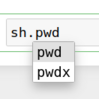

# pyshell
> A Shell class to exectue shell commands as object methods.


## Install

```
pip install bpyshell
```

## How to use

Import

```python
from pyshell.core import *
```

Create a shell object

```python
sh = Shell()
```

Call shell commands as object methods

```python
print(sh.ls())
```

    00_core.ipynb
    autocomplete.png
    CONTRIBUTING.md
    docker-compose.yml
    docs
    index.ipynb
    LICENSE
    Makefile
    MANIFEST.in
    manpage.png
    pyshell
    README.md
    settings.ini
    setup.py


Use the `flags` kwarg for single dash arguments

```python
print(sh.ls('.giti*', flags='a'))
```

    .gitignore


Use kwargs for double dash arguments

```python
print(sh.du('.', max_depth=0))
```

    324	.


You can use tab to autocomplete:



If there is a man page, it becomes the method's docstring


## Limitations

Each command is executed as a different process.
